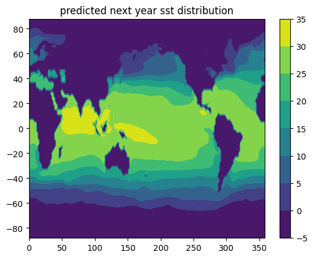
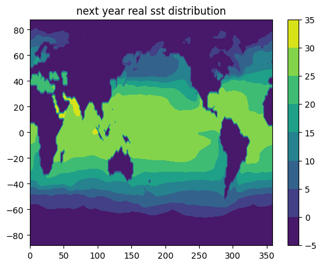

# ConvLSTM + Sea-surface-temperature Prediction

## 1.Dataset

数据集 sst.mnmean.v4.nc or sst.mnmean.v3.nc 下载地址:[.nc file of sst](https://psl.noaa.gov/repository/entry/show?entryid=synth%3Ae570c8f9-ec09-4e89-93b4-babd5651e7a9%3AL25vYWEuZXJzc3Qvc3N0Lm1ubWVhbi52My5uYw%3D%3D)

And in matlab we use ncread and ncinfo to extract useful information:

```matlab
info = ncinfo('sst.mnmean.v4.nc')
info = 
  包含以下字段的 struct:

      Filename: 'E:\R2020a\bin\mytools_candel\sst.mnmean.v4.nc'
          Name: '/'
    Dimensions: [1×4 struct]
     Variables: [1×5 struct]
    Attributes: [1×30 struct]
        Groups: []
        Format: 'netcdf4_classic'
variable_names
variable_names =
  1×5 cell 数组
    {'lat'}    {'lon'}    {'time_bnds'}    {'time'}    {'sst'}
```

保存的信息有: latitude,longitude,time_bnds(boundary),time, sst ,格式为: .mat 文件并且在python中用: Scipy.io 打开

```matlab
temp = reshape(sst(:,:,145),180,89);% 145 and be substituted by any integer from 1 to 1993
>> seamask = (abs(temp)> 1.0e9);
>> imshow(seamask)
```

 seamask 变量是掩码, 将在ConvLSTM的运算中起到遮掩不必要区域(陆地)的作用.

The sea surface has a proper temperature from about -1 to 37 centigrade.The mask value turns 1 on the land while 0 on the sea surface. 

```matlab
save('sea_surface_temperature.mat', 'seamask', 'sst', 'lon','lat','time_bnds');
```

## 2.Train+Test:

脚本中的sequence_length是前面序列的长度,也即用来推理下一时刻结果的序列长度;

在程序中设置成了24,也就是两年,损失采用了MSELoss,并且把train_size作为训练个数(程序中取为90%),每训练完一个epoch进行test上的推理,这个推理是需要使用test前面的24个train生成一个预测结果,然后把预测结果作为新的输入,迭代而成的。

紧跟着训练集之后的第一个时刻的预测MSE = 0.9964,计算时需要把温度区间使用归一化后的尺寸还原;同理训练时需要使用min-max归一化;

|               |                |
| ------------- | -------------- |
|  |  |

效果如上.

Jupyter Notebook:在文件中.